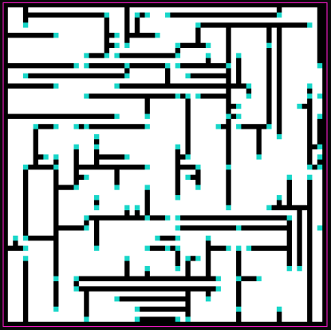

# Mazer
## Overview

  

The goal of this project was to develop a playable maze game using procedural generation. The game features a random maze generator with configurable parameters, allowing players to navigate from point A to point B. Additional elements such as player movement, camera systems, map editor mode, collectible items, and more were implemented to enhance gameplay.

## Authors

- [@notkatsuu](https://www.github.com/notkatsuu) - Pau Castellà Reig
- [@ShadowLoker](https://www.github.com/ShadowLoker) - Lluc Koome Cebrià
## License

[MIT](https://choosealicense.com/licenses/mit/)

## Content Checklist

- [x] Maze generation function with configurable parameters
- [x] Player 2D movement from predefined start point to end point
- [x] Camera 2D system following player movement
- [x] Visual map editor mode for maze editing
- [x] Collectible map items to increase player score
- [x] Support for multiple maze biomes
- [x] Camera 3D system and 3D maze mode
- [x] Time limit to complete the map
- [x] Audio fx and background music
- [x] Editor UI using raygui for map configuration

## Controls

- **Mouse**: Map editor mode to set/clear pixels or set item position
- **Keyboard**: Cursors/WASD to move player in 2D/3D map
- **Keyboard**: ESCAPE to exit game and close program

## Tools Used

- **IDE**: Visual Studio 2022
- **Library**: raylib - [GitHub Repository](https://github.com/raysan5/raylib)
- **UI Library**: raygui - [GitHub Repository](https://github.com/raysan5/raygui)

## Learning Outcomes

This project allowed the application of various concepts including procedural maze generation, custom edition tools creation, low-level programming, and graphics manipulation. Utilizing the raylib framework facilitated quick prototyping and development.

## Submission Rules

The project was submitted as a .zip file named "Delivery04_GroupX.zip" to the "Delivery04" folder on the Aula Virtual platform. The structure and naming conventions followed the guidelines provided in the assignment.

## About Game Assets

All assets used in the game are legal and free for use. Original assets created by the team members were licensed accordingly, while assets obtained from external sources include proper license details attached to the project.

## Helpful Links

- [Open Game Art](https://opengameart.org/)
- [Kenney • Assets](https://kenney.nl/assets)
- [GameDev Market](https://www.gamedevmarket.net/)
- [Free Game Assets](https://freegameassets.itch.io/)
- [raylib code examples](https://www.raylib.com/examples.html)

---
*Note: Replace "maze_game_screenshot.png" with a screenshot of the game for your GitHub repository.*
